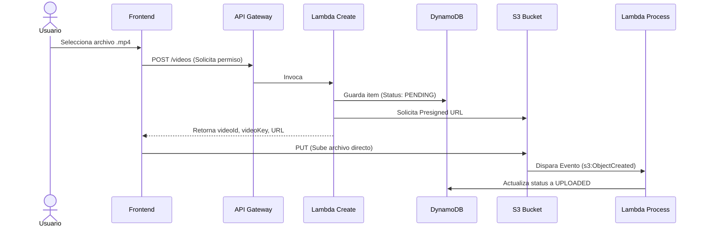

# 📹 Flujo de Subida de Videos (Serverless)

Este proyecto implementa un flujo eficiente para la carga de videos usando AWS S3, DynamoDB y funciones Lambda, aprovechando URLs pre-firmadas para subir archivos directamente desde el frontend.

---

## 🚀 Endpoints y Funciones

### 1. Create Video

- **Función:** `create-video`
- **Descripción:**
  - Genera una URL pre-firmada para subir el video directamente a S3.
  - Guarda la metadata del video en DynamoDB con estado inicial `PENDING`.
- **Variables generadas:**
  - `videoId`: ID único del video
  - `videoKey`: Ruta S3 (`users/{userId}/videos/{videoId}/{videoName}`)
  - `presignedUrl`: URL para subir el archivo a S3

### 2. Process Video Upload

- **Función:** `process-video-upload`
- **Descripción:**
  - Escucha eventos de subida exitosa a S3 (`s3:ObjectCreated`)
  - Actualiza el estado del video en DynamoDB a `UPLOADED` o `FAILED` según corresponda

---

## 🏗️ Diagrama de Flujo

---
